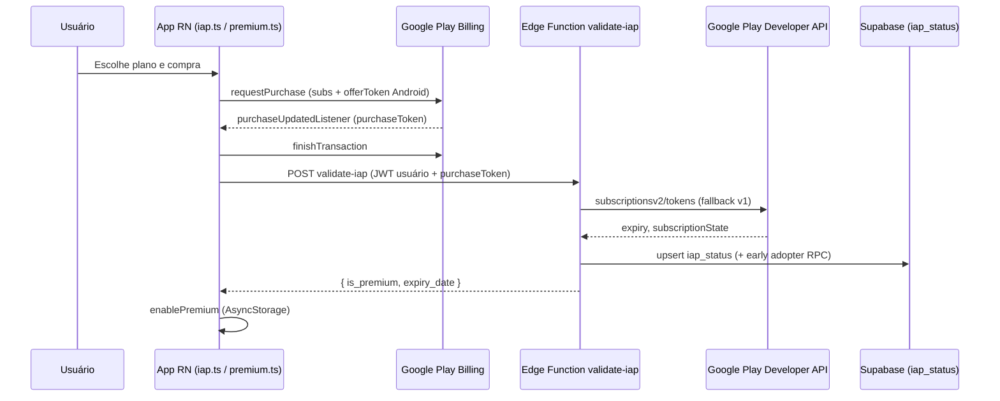
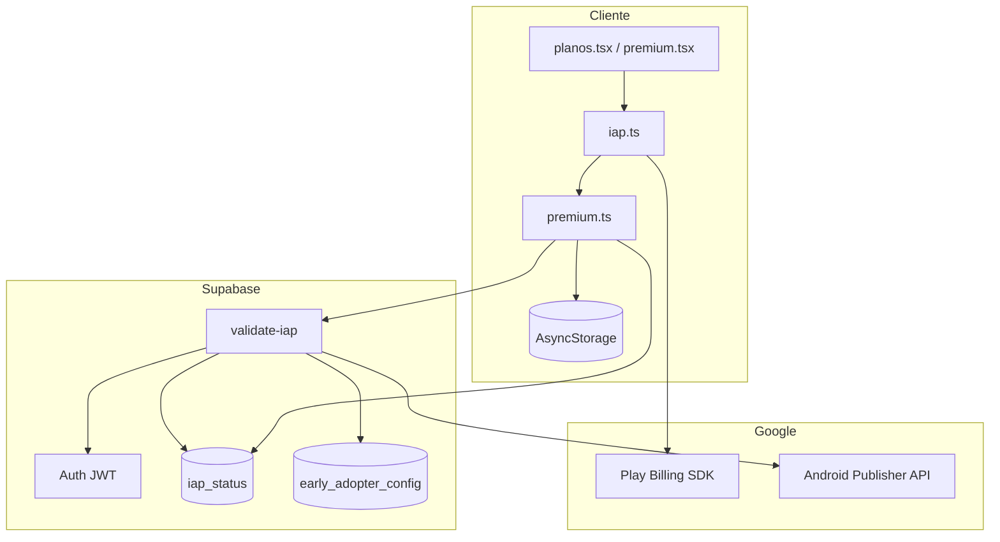

# Especificação de Arquitetura — Sistema de Pagamentos (IAP + Supabase + Google Play)

> **Propósito:** Documento portável para reimplementar este sistema de assinaturas em outro app React Native / Expo. Descreve o que existe hoje no projeto **venda-mobile**, com contratos, fluxos, schema, variáveis de ambiente e decisões de engenharia necessárias para uma IA ou equipe reproduzir a solução do zero.

> **Fonte da verdade:** Código em `lib/iap.ts`, `lib/premium.ts`, `lib/subscriptions.ts`, `supabase/functions/validate-iap/index.ts`, `supabase/setup-database.sql` e telas `app/planos.tsx`, `app/premium.tsx`.

---

## 1. Resumo executivo

| Camada | Tecnologia | Responsabilidade |
|--------|------------|------------------|
| Loja nativa | Google Play Billing (via `react-native-iap` v14) | UI de compra, tokens, renovação |
| Backend | Supabase Edge Function `validate-iap` | Validar recibo/token na API do Google (e Apple, se habilitado) |
| Persistência | Supabase PostgreSQL (`iap_status`) | Estado canônico de assinatura por usuário |
| Autenticação | Supabase Auth + Google Sign-In nativo | JWT do usuário obrigatório para validar compra |
| Cliente | AsyncStorage | Cache offline de premium + fila de validação pendente |

**Princípio central:** A loja confirma o pagamento; o **backend** confirma o direito de acesso; o app **cacheia** para UX offline, mas **não revoga** premium por falha de rede temporária.

---

## 2. Diagrama de arquitetura





---

## 3. Stack e dependências

### 3.1 Pacotes npm (versões do projeto de referência)

| Pacote | Versão | Uso |
|--------|--------|-----|
| `react-native-iap` | ^14.7.20 | Billing nativo (named exports v14, Nitro Modules) |
| `react-native-nitro-modules` | ^0.35.0 | Requerido pelo rn-iap v14 |
| `@supabase/supabase-js` | ^2.98.0 | Auth + queries + (opcional) invoke |
| `@react-native-async-storage/async-storage` | 2.2.0 | Cache premium |
| `@react-native-google-signin/google-signin` | ^16.1.2 | Login antes da compra |
| `expo-dev-client` | ~6.0.20 | **Obrigatório** — IAP não funciona no Expo Go |
| `patch-package` | ^8.0.1 | Patch de build Android do rn-iap |

### 3.2 Configuração Expo (`app.json`)

- Plugin: `"react-native-iap"`
- `newArchEnabled: true`
- Android `permissions`: `BILLING`, `INTERNET`, `ACCESS_NETWORK_STATE`
- Android `package` / iOS `bundleIdentifier`: devem coincidir com `ANDROID_PACKAGE_NAME` na Edge Function

### 3.3 AndroidManifest

```xml
<uses-permission android:name="android.permission.BILLING"/>
<uses-permission android:name="com.android.vending.BILLING"/>
```

---

## 4. Produtos e SKUs (Google Play Console)

Os IDs no código **devem ser idênticos** aos cadastrados no Play Console.

| SKU (`productId`) | Tipo | Período | Uso no app |
|-------------------|------|---------|------------|
| `premium_monthly_plan` | Assinatura | 1 mês | `PRODUCT_IDS.MONTHLY` |
| `premium_yearly_plan` | Assinatura | 12 meses | `PRODUCT_IDS.ANNUAL` |

**Constantes no código:**

```typescript
// lib/iap.ts e lib/subscriptions.ts
export const PRODUCT_IDS = {
  MONTHLY: 'premium_monthly_plan',
  ANNUAL: 'premium_yearly_plan',
};
```

### 4.1 Play Billing v5+ (Android)

No Android, cada assinatura exige **`offerToken`** de `subscriptionOfferDetailsAndroid` (rn-iap v14 expõe como `subscriptionOfferDetailsAndroid` ou aliases). Fluxo:

1. No `initializeIAP()`, pré-buscar produtos com `fetchProducts({ skus, type: 'subs' })` e cachear em `productCache`.
2. Em `purchaseSubscription()`, montar:

```typescript
{
  type: 'subs',
  request: {
    google: {
      skus: [productId],
      subscriptionOffers: [{ sku: productId, offerToken }],
    },
  },
}
```

Sem `offerToken`, a Play Store pode rejeitar a compra.

### 4.2 Preços na UI

- **Canônico na loja:** `getCachedProductLocalizedPrice(productId)` lê `formattedPrice` do cache IAP.
- **Marketing / early adopter:** `lib/early-adopters.ts` define preços de exibição (R$ 9,90 / R$ 99,00 etc.) — não substituem o valor cobrado pelo Google.

---

## 5. Autenticação (pré-requisito de pagamento)

Compras são validadas no backend **vinculadas ao `user_id` do JWT Supabase**.

### 5.1 Fluxo de login

1. `@react-native-google-signin/google-signin` → `idToken`
2. `supabase.auth.signInWithIdToken({ provider: 'google', token: idToken })`
3. Sessão persistida; `purchaseUpdatedListener` loga snapshot de auth antes de processar compra

### 5.2 Variáveis de ambiente (app)

| Variável | Obrigatória | Descrição |
|----------|-------------|-----------|
| `EXPO_PUBLIC_SUPABASE_URL` | Sim | URL do projeto Supabase |
| `EXPO_PUBLIC_SUPABASE_ANON_KEY` | Sim | Anon key (chamadas REST e header `apikey`) |
| `EXPO_PUBLIC_GOOGLE_WEB_CLIENT_ID` | Sim | OAuth Web Client ID (mesmo do provider Google no Supabase) |
| `EXPO_PUBLIC_IAP_LOG_FULL_TOKENS` | Não | `true` loga tokens completos (só debug) |
| `EXPO_PUBLIC_IAP_AUTH_DEBUG` | Não | `true` ou `__DEV__` ativa logs `[AUTH DEBUG]` |

**Regra:** Se `validateSubscription()` for chamada sem sessão → retorno `reason: 'auth'`.

---

## 6. Banco de dados Supabase

Executar script base: `supabase/setup-database.sql` (idempotente).

### 6.1 Tabela `iap_status`

| Coluna | Tipo | Descrição |
|--------|------|-----------|
| `id` | uuid PK | |
| `user_id` | uuid FK → `auth.users` | Um registro por usuário/plataforma (upsert por `user_id` + `platform`) |
| `platform` | text | `'android'` (SQL atual); código suporta também `'ios'` |
| `product_id` | text | SKU da loja |
| `purchase_token` | text | Android: `purchaseToken`; iOS: `transactionReceipt` |
| `expiry_date` | timestamptz | Expiração validada pela loja |
| `is_premium` | boolean | Acesso ativo agora |
| `has_lifetime_access` | boolean | Grant manual vitalício (não revalida loja) |
| `is_early_adopter` | boolean | Slot do programa early adopter |
| `discount_percentage`, `original_price`, `discounted_price` | opcionais | Metadados comerciais |
| `created_at`, `updated_at` | timestamptz | |

**RLS:**

- `authenticated`: SELECT apenas `auth.uid() = user_id`
- `service_role`: INSERT/UPDATE (Edge Function usa service role)

### 6.2 Early adopter (opcional)

| Objeto | Função |
|--------|--------|
| `early_adopter_config` | `total_slots`, `current_count`, `is_active` |
| `claim_early_adopter_slot()` | Incremento atômico com `FOR UPDATE` |
| `get_early_adopter_status()` | RPC para UI de vagas |

A Edge Function chama `claim_early_adopter_slot` **somente quando** `is_premium === true` após validação na loja.

> **Inconsistência documentada:** `setup-database.sql` usa 300 slots; `lib/early-adopters.ts` exibe 1000 com +20 de “social proof”. Ao portar, unificar uma única regra de negócio.

### 6.3 Grants manuais (suporte / migração)

Conceder premium sem loja:

- `has_lifetime_access = true`, ou
- `purchase_token` prefixado `manual_grant_`, ou
- `product_id` contendo `lifetime` / `vitalicio` (legado)

Esses registros **não** disparam revalidação Google Play em `checkSubscriptionFromDatabase()`.

---

## 7. Edge Function `validate-iap`

**Caminho:** `supabase/functions/validate-iap/index.ts`  
**Runtime:** Deno (Supabase Edge Functions)

### 7.1 Secrets / variáveis (Supabase Dashboard → Edge Functions → Secrets)

| Secret | Plataforma | Descrição |
|--------|------------|-----------|
| `SUPABASE_URL` | — | Injetado automaticamente |
| `SUPABASE_ANON_KEY` | — | Validar JWT do usuário |
| `SUPABASE_SERVICE_ROLE_KEY` | — | Escrita em `iap_status` |
| `ANDROID_PACKAGE_NAME` | Android | Ex.: `com.renanduart3.vendamobile` |
| `GOOGLE_SERVICE_ACCOUNT_KEY` | Android | JSON completo da service account (string) |
| `APPLE_SHARED_SECRET` | iOS | App Store shared secret |
| `APPLE_VERIFY_URL` | iOS | Opcional; default produção Apple |
| `LOG_FULL_TOKENS` | — | `true` para debug de tokens |

### 7.2 Service Account Google (Android Publisher API)

1. Google Cloud Console → criar service account
2. Conceder acesso no Play Console → **Users and permissions** → permissão financeira de assinaturas
3. Ativar **Google Play Android Developer API**
4. Colar JSON em `GOOGLE_SERVICE_ACCOUNT_KEY`

A função gera JWT RS256 (`androidpublisher` scope) e obtém `access_token` OAuth2.

### 7.3 Contrato HTTP

**Endpoint:** `POST {SUPABASE_URL}/functions/v1/validate-iap`

**Headers:**

| Header | Valor |
|--------|-------|
| `Content-Type` | `application/json` |
| `apikey` | `SUPABASE_ANON_KEY` |
| `Authorization` | Modo A: `Bearer <user_jwt>` **ou** Modo B: `Bearer <anon_key>` |
| `X-User-JWT` | Modo B: JWT do usuário |
| `X-Auth-Mode` | Hint: `authorization-user-jwt` \| `authorization-anon-with-x-user-jwt` |

**Body:**

```json
{
  "platform": "android",
  "purchaseToken": "<token da compra>",
  "productId": "premium_monthly_plan",
  "sessionJwt": "<opcional; mesmo JWT no modo B>"
}
```

**Resposta 200:**

```json
{
  "is_premium": true,
  "expiry_date": "2026-07-03T12:00:00.000Z",
  "platform": "android",
  "product_id": "premium_monthly_plan",
  "error": null
}
```

**Erros:** 400 (campos faltando), 401 (JWT inválido), 502 (falha Google/Apple), 500 (misconfig / interno)

### 7.4 Validação Google Play

Ordem de tentativa:

1. **API v2:** `GET .../purchases/subscriptionsv2/tokens/{purchaseToken}`
   - Estados ativos: `SUBSCRIPTION_STATE_ACTIVE`, `SUBSCRIPTION_STATE_IN_GRACE_PERIOD`
   - `is_premium = stateActive && expiryTime > now`
2. **Fallback v1:** `GET .../purchases/subscriptions/{productId}/tokens/{purchaseToken}`
   - `paymentState` 1 ou 2 e não expirado

### 7.5 Validação Apple (iOS)

- POST `verifyReceipt` com shared secret
- Status `21007` → retry sandbox
- `is_premium` se `expires_date_ms > now` e sem `cancellation_date_ms`

### 7.6 Persistência pós-validação

```typescript
// Upsert lógico: UPDATE por user_id+platform; se 0 rows, INSERT
persistIapStatus({
  user_id: authenticatedUserId,
  platform,
  product_id,
  purchase_token: purchaseToken,
  expiry_date,
  is_premium,
  is_early_adopter, // só definido quando is_premium true
  updated_at: ISO8601,
});
```

---

## 8. Cliente — módulos e responsabilidades

```
lib/
├── iap.ts              # Play Billing: init, listeners, compra, restore, cache de produtos
├── premium.ts          # Gate premium, validate-iap HTTP, sync DB, AsyncStorage
├── subscriptions.ts    # SubscriptionManager (facade para planos.tsx)
└── early-adopters.ts   # UI comercial de vagas/preços (não valida pagamento)

app/
├── _layout.tsx         # initializeIAP() no boot; SubscriptionBootstrapper
├── planos.tsx          # UI principal de assinatura
├── premium.tsx         # Upsell / compra direta
└── loading.tsx         # checkSubscriptionFromDatabase no primeiro login

supabase/
├── setup-database.sql
└── functions/validate-iap/index.ts
```

### 8.1 `lib/iap.ts` — ciclo de vida

| Função | Comportamento |
|--------|---------------|
| `initializeIAP()` | `require('react-native-iap')` dinâmico; `initConnection`; listeners; flush pending Android; pré-cache SKUs |
| `purchaseSubscription(productId)` | Promise + fila `purchaseResultQueue`; aguarda listener |
| `processPurchase(purchase, source)` | `finishTransaction` → `validateSubscription` → ou fallback local se infra falhar |
| `restorePurchases()` | `getAvailablePurchases()` + `processPurchase` cada uma |
| `getCachedProductLocalizedPrice()` | Preço formatado da loja |

**Classificação de erros (`PurchaseFailureReason`):**

| Reason | Significado |
|--------|-------------|
| `cancelled` | Usuário cancelou |
| `auth` | Sem sessão / JWT inválido na validação |
| `config` | Billing indisponível, SKU errado, sem offerToken |
| `validation` | Loja respondeu mas assinatura inativa |
| `infra` | Rede, timeout, 5xx — **pode ativar fallback local** |

**Fallback de infra (boa fé):** Se a Play confirmou compra mas `validate-iap` falhou por infra:

1. `savePendingIapValidation(platform, token, productId)`
2. `enablePremium(fallbackExpiry)` — 31 dias (mensal), 366 (anual), 3650 (lifetime SKU)
3. Retorna `success: true` para não bloquear quem pagou

**Deduplicação:** eventos de compra repetidos em 120s ignorados via chave `platform:productId:token`.

### 8.2 `lib/premium.ts` — estado e sincronização

#### AsyncStorage

| Chave | Conteúdo |
|-------|----------|
| `is_premium_v1` | `'1'` se premium |
| `premium_expiry_date` | ISO string |
| `has_lifetime_v1` | `'1'` vitalício |
| `premium_platform` | `android` \| `ios` |
| `premium_product_id` | SKU |
| `premium_db_check_ms` | último sync bem-sucedido com DB |
| `validate_iap_auth_mode_v1` | modo JWT que funcionou |
| `pending_iap_validation_v1` | JSON `{ platform, purchaseToken, productId, savedAtMs }` |

#### `isPremium(forceRefresh?)`

1. Se cache DB > 24h ou `forceRefresh` → `checkSubscriptionFromDatabase()`
2. Se sync DB falhou (rede) → **não** remove premium; usa cache local
3. Se `expiry_date` local passou mas sync falhou → mantém premium (boa fé offline)
4. Vitalício (`has_lifetime_v1`) → sempre true

#### `validateSubscription(platform, token, productId)`

- Exige usuário logado
- HTTP direto para Edge Function (não usa `supabase.functions.invoke` — controle fino de headers)
- Dois modos de auth com fallback automático em 401
- `getFreshAccessContext()` refresh se token expira em ≤ 60s ou ausente
- Deduplica chamadas simultâneas (mesmo token+produto)

#### `checkSubscriptionFromDatabase(options?)`

| Cenário | Ação |
|---------|------|
| `has_lifetime_access` | `enablePremium` sem loja |
| `is_premium` + token salvo | Revalida via `validateSubscription` (detecta cancelamento) |
| Falha infra na revalidação | Degrada para valor do DB |
| `skipStoreRevalidation: true` | Usado logo após compra em `planos.tsx` |
| Sem premium no DB | `disablePremium()` |

#### `syncPendingIapValidationIfAny()`

Chamado no início de `checkSubscriptionFromDatabase`; reenvia compra pendente.

### 8.3 `lib/subscriptions.ts`

`SubscriptionManager` — wrapper fino:

- `purchaseSubscription(plan)` → import dinâmico de `iap.purchaseSubscription(plan.sku)`
- `getActiveSubscription()` → `isPremium` + `getPremiumStatus`
- `cancelSubscription()` → Alert direcionando ao Google Play (cancelamento só na loja)

### 8.4 Boot do app (`app/_layout.tsx`)

```typescript
// No mount do RootLayout
await db.initDB();
await initializeIAP();

// SubscriptionBootstrapper (quando autenticado)
await checkSubscriptionFromDatabase();
await isPremium();
```

### 8.5 Gate de features no app

Qualquer tela chama `isPremium()` ou `isPremium(true)` antes de liberar:

- Relatórios avançados (`lib/advanced-reports.ts`, `app/relatorios.tsx`)
- Export/backup (`app/settings.tsx`)
- Edição de vendas, WhatsApp, PIX QR (`SUBSCRIPTION_PLANS.features`)
- Abas produtos/finanças/vendas

Padrão recomendado ao portar:

```typescript
const premium = await isPremium();
if (!premium) router.push('/planos');
```

---

## 9. Fluxos detalhados

### 9.1 Compra nova (`planos.tsx` → `doSubscribe`)

1. Usuário autenticado
2. Modal “Aguardando Google Play…”
3. `subscriptionManager.purchaseSubscription(currentPlan)`
4. Listener → `processPurchase` → `validate-iap` → `enablePremium`
5. `checkSubscriptionFromDatabase({ skipStoreRevalidation: true })`
6. Se ainda não premium → alerta “sincronizando”
7. Sucesso → atualiza UI / redirect

**Upgrade mensal → anual:** Alert avisando cobrança imediata e cancelamento manual do mensal no Play.

### 9.2 Restauração

| Entrada | Fluxo |
|---------|-------|
| Automática no startup | `initializeIAP` → `getAvailablePurchases` → `processPurchase(..., 'restore')` |
| Botão em `premium.tsx` | `restorePurchases()` |
| “Verificar acesso” em `planos.tsx` | `checkSubscriptionFromDatabase` → se falhar, `iapRestorePurchases()` |

### 9.3 Cancelamento / expiração

- Usuário cancela no **Google Play** (não no app)
- Na próxima `checkSubscriptionFromDatabase` (≤ 24h ou force), revalidação na API Google → `is_premium: false` → `disablePremium()`

### 9.4 Falha de rede pós-compra

1. Compra OK na Play
2. `validate-iap` timeout → fallback local + `pending_iap_validation_v1`
3. Próximo boot com internet → `syncPendingIapValidationIfAny` reconcilia DB

---

## 10. Observabilidade

### 10.1 Prefixos de log

| Prefixo | Origem |
|---------|--------|
| `[IAP][LIFECYCLE]` | iap.ts — init, listeners, cache |
| `[IAP][CANCELLED\|AUTH\|CONFIG\|VALIDATION\|INFRA]` | iap.ts — erros classificados |
| `[Premium][AUTH\|INACTIVE\|INFRA\|CACHE]` | premium.ts |
| `[AUTH DEBUG]` | premium.ts (flag env) |
| `[validate-iap][REQ\|AUTH]` | Edge Function |

### 10.2 Produção

Em `app/_layout.tsx`, `console.*` é no-op quando `!__DEV__`. Para produção, integrar Sentry/Datadog se necessário.

---

## 11. Segurança

| Tópico | Implementação |
|--------|---------------|
| Validação de recibo | **Sempre no servidor** — cliente nunca confia só no token local |
| JWT na Edge Function | `auth.getUser()` com token do usuário; ignora `userId` divergente no body |
| Service role | Apenas na Edge Function, nunca no app |
| Anon key no Authorization | Modo gateway: anon no `Authorization`, JWT real em `X-User-JWT` |
| Tokens em log | Truncados por padrão; SHA-256 fingerprint na Edge Function |
| RLS | Usuário só lê próprio `iap_status` |

**Não fazer:** armazenar `GOOGLE_SERVICE_ACCOUNT_KEY` no app; validar premium só com AsyncStorage sem sync periódico.

---

## 12. Checklist de implementação em projeto novo

### Fase A — Google Play + projeto

- [ ] Conta Google Play com app publicado (pelo menos faixa de teste interna)
- [ ] Criar assinaturas `premium_monthly_plan` e `premium_yearly_plan` com base plans e preços
- [ ] Adicionar licenças de teste (Settings → License testing)
- [ ] Build **release/signed** ou internal testing — billing não funciona em debug local puro
- [ ] `BILLING` permission e package name fixos

### Fase B — Supabase

- [ ] Projeto Supabase + Auth Google provider
- [ ] Executar `setup-database.sql`
- [ ] Deploy `validate-iap` com secrets
- [ ] Service account ligada ao app no Play Console

### Fase C — App React Native

- [ ] `expo-dev-client` + prebuild nativo
- [ ] Copiar/adaptar `lib/iap.ts`, `lib/premium.ts`, `lib/subscriptions.ts`
- [ ] Variáveis `EXPO_PUBLIC_*`
- [ ] `initializeIAP` no root layout
- [ ] Telas de planos + Auth Google antes de comprar
- [ ] Gates `isPremium()` nas features pagas
- [ ] `patch-package` se build Android do rn-iap falhar (caminho CMake)

### Fase D — Testes

- [ ] Compra mensal com conta de teste
- [ ] Kill app durante compra → reabrir → premium ativo
- [ ] Avião mode após compra → fallback local → sync posterior
- [ ] Cancelar assinatura no Play → aguardar revalidação (< 24h ou force refresh)
- [ ] `restorePurchases` em segundo dispositivo (mesma conta Google + mesmo login Supabase)
- [ ] Logs Supabase Edge Function sem 401 em loop

---

## 13. Arquivo legado / não usar

| Arquivo | Status |
|---------|--------|
| `hooks/useSubscription.ts` | **Legado** — SKUs antigos (`sub_premium_mensal`), API v12; não integrado ao fluxo atual |
| `active_subscription` (AsyncStorage) | **Removido** — não usar |

---

## 14. Referência rápida de APIs públicas (para portar)

### Cliente — exportações principais

```typescript
// iap.ts
initializeIAP(): Promise<boolean>
purchaseSubscription(productId: string): Promise<PurchaseResult>
restorePurchases(): Promise<{ success, error?, restored }>
getProducts(): Promise<Product[]>
getCachedProductLocalizedPrice(productId: string): string | null
PRODUCT_IDS: { MONTHLY, ANNUAL }

// premium.ts
isPremium(forceRefresh?: boolean): Promise<boolean>
getPremiumStatus(): Promise<PremiumStatus>
validateSubscription(platform, purchaseToken, productId): Promise<PremiumValidationResult>
checkSubscriptionFromDatabase(opts?: { skipStoreRevalidation?: boolean })
enablePremium / disablePremium
syncPendingIapValidationIfAny(): Promise<void>
```

### Edge Function — entrada/saída

Ver seção 7.3.

---

## 15. Mapeamento de telas e UX de erro

| `result.reason` | Mensagem sugerida (planos/premium) |
|-----------------|-------------------------------------|
| `cancelled` | Silencioso (sem alert) |
| `auth` | “Faça login novamente” |
| `config` | “Play Store indisponível ou SKU não configurado” |
| `validation` | “Compra não validada como ativa” |
| `infra` | Erro genérico / tente verificar acesso |

---

## 16. Extensões futuras (não implementadas aqui)

- **RTDN / Pub/Sub** do Google Play para revogar premium em tempo real (hoje: polling 24h + revalidação no `checkSubscriptionFromDatabase`)
- **App Store** completa em produção (código iOS existe na Edge Function, SQL restringe `platform` a `android`)
- **Webhook Stripe** — arquitetura atual é 100% IAP nativo

---

## 17. Versionamento desta especificação

| Campo | Valor |
|-------|-------|
| App version (referência) | 1.0.54 (`app.json`) |
| rn-iap | 14.7.20 |
| Pacote Android | `com.renanduart3.vendamobile` |
| Documento gerado a partir do repo | venda-mobile (estado funcional Supabase + Google Play) |

---

*Este documento é autossuficiente para replicação. Ao implementar em outro projeto, substitua SKUs, package name, textos de UI e política de early adopter, mantendo os contratos entre **Play token → validate-iap → iap_status → isPremium()**.*
